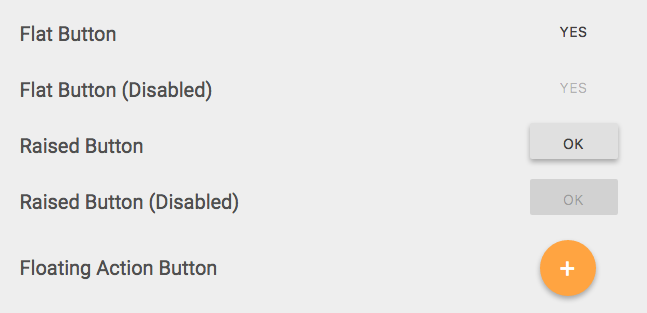

# MaterialCSS
A set of pure CSS Material Design styles

[](https://dudeofawesome.github.io/MaterialCSS/)

Demo - https://dudeofawesome.github.io/MaterialCSS/

How to use:

1. Import material.scss into your main SASS stylesheet

  ```SASS
@import 'material';
```

1. Set your color scheme in _colors.scss
1. Apply the appropriate classes to each element you want styled

  ```HTML
  <input class="material light" type="checkbox">
  <input disabled class="material light raised" value="ok" type="button">
  ```
  Switches need a little bit of extra work
  ```HTML
  <div class="material light switch">
	<input id="toggle-1" type="checkbox">
	<label for="toggle-1"></label>
</div>
	```
1. ????
1. PROFIT!!!
